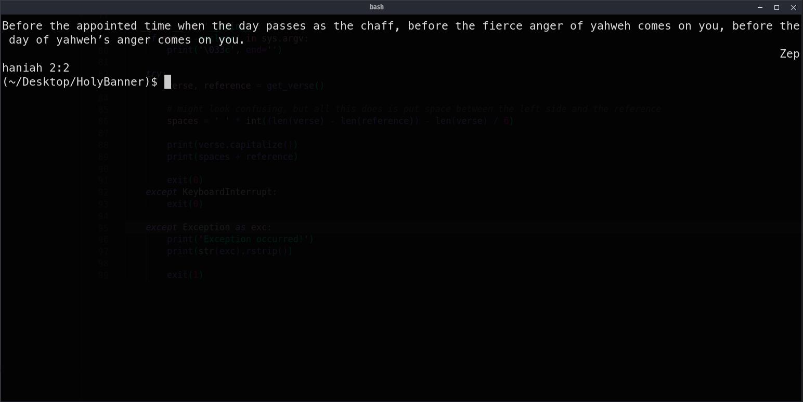

# HolyBanner
Tired of your plain, empty and unholy terminal? Well, time for a blessing! <br>
This script allows you to fetch random biblical quotes using <a href="https://bible-api.com/">bible-api</a> <br>
It works offline aswell.

# Requirements
- A terminal (duhh)
- Python 3

# Usage
1. Clone the repository
```
git clone https://github.com/sym-p1337/HolyBanner
```

2. Navigate into the directory
```
cd HolyBanner
```

3. Install depencies
```
pip install -r requirements.txt
```

4. Add it to your bashrc (or you can edit your settings using registry editor) <!-- windows moment -->

5. Profit

# Images



# Known issues
 - Sometimes, when a verse is very long it'll screw up the lining. Will fix that in the future (shouldn't be too hard)